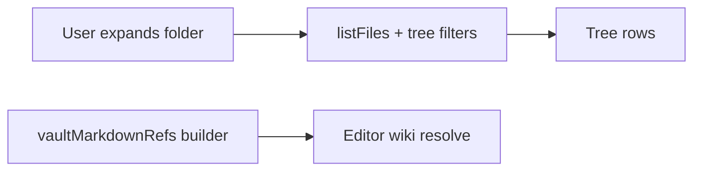

# Desktop companion shell patterns

Conventions for the **primary** Eskerra desktop window (`apps/desktop`). Settings and other surfaces may use a **separate Tauri window**; this document is about the main shell.

## Main workspace: Vault tree, Episodes, editor (two-model rule for the tree)

The **left rail** has two **independent toggles** (see **`RailNav`** in **`apps/desktop/src/components/RailNav.tsx`**): **Vault** at the **top** of the rail and **Episodes** at the **bottom** (a **`rail-spacer`** flex filler sits between them). **Vault** shows or hides the **vault tree** pane; **Episodes** shows or hides the **episodes list** pane. The **markdown editor** is **always** visible to the right of any visible side columns. When **both** panes are open, **`MainWorkspaceSplit`** (**`apps/desktop/src/components/MainWorkspaceSplit.tsx`**) places **Vault above Episodes** in a single left column using **`DesktopVerticalSplit`** (**`apps/desktop/src/components/DesktopVerticalSplit.tsx`**), then **`DesktopHorizontalSplit`** places that column **left of the editor**. When only one pane is open, a single horizontal split applies. The tree is implemented by **`VaultPaneTree`** (**`apps/desktop/src/components/VaultPaneTree.tsx`**); episode rows use **`EpisodesPane`** (**`apps/desktop/src/components/EpisodesPane.tsx`**). Podcast catalog loading runs in **`useDesktopPodcastCatalog`** so playback works even when the Episodes pane is hidden.

**Two separate models — do not mix them:**

| Model | Role | Performance |
|--------|------|--------------|
| **Vault tree** | **Lazy and expansion-driven:** each expanded folder loads children with **`listFiles`** plus tree visibility rules (`filterVaultTreeDirEntries` and related helpers in **`@eskerra/core`**). | Must stay cheap on expand; no vault-wide crawl in the UI thread for navigation. |
| **Wiki reference index** | **Vault-wide and asynchronous:** flat **`vaultMarkdownRefs`** (`{ name, uri }[]` for eligible `.md` paths), built in the background (`collectVaultMarkdownRefs` in **`useMainWindowWorkspace`**). | Must not block first paint or tree interaction; resolve/autocomplete may be briefly stale until the index catches up. |

- **Do not** drive tree expansion from the wiki index, or walk the whole vault from the tree to serve wiki resolve.
- **Do** use the async index only for resolve, autocomplete, and resolved/unresolved styling in the editor.

Implementation pointers: tree load **`apps/desktop/src/lib/vaultTreeLoadChildren.ts`**; vault markdown refs **`packages/eskerra-core/src/vaultMarkdownRefs.ts`**.

### Vault tree vs. open note (manual reveal)

The vault tree **does not** follow the editor: changing the active note (tabs, wiki navigation, etc.) **must not** auto-expand folders or move tree selection. Expansion and selection are **user-owned** until explicitly synced.

To locate the current note, use **Show active note in tree** in the **Vault** pane header (`location_searching` in **`VaultTreePane`**, beside **Add entry**). That bumps **`revealActiveNoteNonce`** in **`VaultTab`**, which **`VaultPaneTree`** handles by loading ancestors, expanding the path, selecting the correct row (including Today hub directory rows), focusing it, and scrolling it into view in the virtual list.

## Today hub directories (vault tree + editor paper)

When a vault **directory** **directly contains** an eligible markdown file named exactly **`Today.md`** (same visibility filters as `loadVaultTreeVisibleChildRows` in **`apps/desktop/src/lib/vaultTreeLoadChildren.ts`>), the tree shows **one row for that directory**: Lucide **`calendar-range`** (24px, matches default 24 viewBox for crisp strokes) in the vault tree row, label = **directory name**, **no expand chevron** (leaf-like; not expandable). **Opening** **`{directory}/Today.md`** uses the same IDE-style pattern as other tree notes: **double-click** the row or press **Enter** while the row is focused (single click only **selects**). Context menu **Open** still opens the hub note. **`Today.md` is not listed** under that folder in the tree. Other files that live only inside that directory are **not** surfaced as child rows (no expand). Sibling entries **at the same parent** as that directory still list normally. Use **Show active note in tree** to select the **directory** row (item id = directory URI) when the hub note is open. Drag-and-drop, rename, and delete on that row treat it like a **folder**. Listing a parent directory performs an extra `listFiles` per visible subdirectory to classify hubs (parallelized). Under one parent, rows sort as **Today hub directories** (A–Z), then **other folders** (A–Z), then **markdown files** (A–Z).

Open-tab **pills** (**`EditorPaneOpenNoteTabs`**) use the parent folder name as the label and the **`today`** Material icon when the tab URI is **`…/Today.md`** (`editorOpenTabPillLabel` / `editorOpenTabPillIconName`). In the **vault tree**, hub rows and eligible **`Today.md`** article rows use the **`calendar-range`** Lucide icon (see **`FileTreeNode`**). Standalone **`Today.md`** article rows match that tree treatment when shown as file rows.

### Today hub canvas (weekly columns)

When the open note is **`Today.md`** (`vaultUriIsTodayMarkdownFile` in **`apps/desktop/src/lib/vaultTreeLoadChildren.ts`**), **`VaultTab`** shows a **weekly canvas** below the main CodeMirror: **`TodayHubCanvas`** in **`apps/desktop/src/components/TodayHubCanvas.tsx`**. The **Linked from** (inbox backlinks) section is **not** shown for that note; it still appears for all other open markdown notes.

- **Placement (not on the white paper):** **`EditorPaneBody`** renders the hub in a **second** **`note-markdown-editor-page`** row directly under the scroll’s first row (fold rail + **`note-markdown-editor-paper`** with CodeMirror only). The hub lives in **`note-markdown-editor-paper--today-hub-shell`**: **transparent** background and **no** paper shadow. With **`note-markdown-editor-scroll--today-hub`**, the **first** editor **`note-markdown-editor-paper`** has **no `box-shadow` and no border** — any **full-height side frame** would still read as one continuous edge through the hub. Week rows use **lighter gray date strips** (**`.today-hub-canvas__row-date-bar`**: **`color-mix`** of **`--nb-editor-margin-bg`** toward **`--nb-editor-paper`**) **above and below** the cell grid (**`.today-hub-canvas__row-date-bar--footer`** is **end-aligned** for the week’s last day); **white rounded cells** (**`.today-hub-canvas__cell`**) only; there is **no** extra **`box-shadow`** on **`.today-hub-canvas__row-cells`**. **`App.css`** gives each date bar **negative inline-end margin / extra width** so the band spans the hub column (cancelling **`today-hub-canvas`** and row right padding). **Even-week zebra** applies only to **`.today-hub-canvas__row-cells`**. With the hub open, **`note-markdown-editor-scroll--today-hub`** sets **`flex: 0 0 auto`** on **both** page rows so the hub is not pushed down by an empty flex-grown paper strip.
- **Hub configuration** is read from optional YAML **frontmatter** on **`Today.md`**: `perpetualType: weekly` (only weekly is implemented), `start:` as a **full English weekday** in lowercase (for example `monday`, `saturday`; default `monday`) determining which **local-calendar day** begins each hub week, and `columns:` as a list of extra column titles (for example `- Next actions`). The main editor column is always the **default** column; each `columns` entry adds one more column to the grid. If `columns` is empty, the canvas is a single column.
- **Row files** live in the **same directory** as **`Today.md`**, named by **local-calendar `YYYY-MM-DD.md`** where the date is the **first day** of that hub week (per `start:`). The canvas shows **53 consecutive week starts** beginning at that weekday in the **previous calendar week**, then stepping +7 days (see **`enumerateTodayHubWeekStarts`** in **`apps/desktop/src/lib/todayHub/`**; **`enumerateTodayHubMondays`** is the `start: monday` case). Each row’s **top** **`.today-hub-canvas__row-date-bar`** contains **`.today-hub-canvas__row-date-bar-cols`**, a grid with the **same** **`grid-template-columns`** and **`gap`** as **`.today-hub-canvas__row-cells`** (and **`width: calc(100% - (20px + 56px + 22px))`** so tracks line up with the cells despite the bar’s extra bleed width): the **first** track shows the **week start** (**`.today-hub-canvas__row-date`**, full weekday + month + day, **runtime locale**); **additional** tracks show **column titles** (**`.today-hub-canvas__col-head`**, from frontmatter **`columns:`**, uppercase muted). **`.today-hub-canvas__row-date`** and **`col-head`** use **`padding-inline-start: var(--today-hub-header-pad-inline-start)`** (**`calc(var(--today-hub-body-pad-inline-start) + 0.8em)`** on **`.today-hub-canvas__row`**, editor-sized **`em`**) so labels line up with list/paragraph text after **`cm-md-list-mark`** spacing; hub cells and **`.cm-content`** still use **`--today-hub-body-pad-inline-start`**, including the **empty-cell** dotted frame (**`::before`** on **`.today-hub-canvas__cell--empty-readonly`**) so the placeholder aligns with body text, not the title-only inset. There is **no** separate global **Weeks** header. The **bottom** bar shows the **inclusive week end** from **`todayHubWeekEndInclusive`**, same date format, **right-aligned** in **`App.css`**. The **first** row (previous week) uses **`today-hub-canvas__row--previous-week`** in **`App.css`**: the **cell grid** uses **`opacity: 0.67`** and **`filter: grayscale(1)`**; **date labels** and **column heads** are **not** under row-level opacity (avoids compositing AA issues) and instead use a **`color-mix`** toward **`--nb-editor-margin-bg`** for readable fade on the gray date strip.
- **Multi-column file body:** segments are separated by a blank line, the line **`::today-section::`**, and another blank line (`\n\n::today-section::\n\n`). **`splitTodayRowIntoColumns`** also accepts EOF immediately after the marker missing a final blank line, a single newline before the marker (when a paragraph break was intended but only one newline was typed), and optional spaces around the marker line. Round-trip **`mergeTodayRowColumns`** still writes the canonical delimiter. Helpers live in **`splitMergeTodayRowColumns.ts`**. After splitting, **lines that contain only** `::today-section::` (optional spaces) are removed from each column body so malformed or duplicated delimiters never appear in hub cell editors.
- **Lazy I/O:** row files are **prehydrated** from disk into **`inboxContentByUri`** when the hub opens; a file is **created on first save** when any column has non-whitespace content. If **all** columns are blank after an edit, the row file is **deleted** and the cache entry removed.
- **Editing:** one cell at a time opens a full **`NoteMarkdownEditor`**; inactive cells show read-only text. **Escape** closes the active cell after flushing the debounced save. Hub row saves use **`persistTransientMarkdownImages`** and **`saveNoteMarkdown`** (see **`persistTodayHubRow`** in **`useMainWindowWorkspace.ts`**) and update **`inboxContentByUri`** like other notes. **`vault-files-changed`** reconcile refreshes cached row bodies when **`Today.md`** is open, except the row currently being edited in the hub (external edits to that file may not apply until the cell is closed).
- Wiki links and relative `.md` links from a hub cell use the **row file URI** as the navigation parent (`todayHubWikiNavParentRef` / `todayHubCellEditorRef` in the workspace hook).

## No modal overlays in the main window

Do **not** add **centered dialogs** on a **dimmed full-window backdrop** for flows inside the main UI. Prefer one of:

- **Panes** in the existing resizable layout (for example the **Editor** column next to optional Vault / Episodes panes).
- **Inline** UI in the current view.
- A **secondary window** when a detached surface is genuinely needed.

This avoids focus traps, stacking issues, and keeps behavior aligned with the pane-based layout.

## Vault workspace: new log entry (Inbox compose)

Creating a new capture note uses the **same Editor pane UI** as editing (single multiline field + footer primary action), in **compose** mode. New entries are created under the vault **Inbox** using the shared title and filename rules:

- Pane header title: **New entry**.
- Trailing control: **Material `clear`**, ghost icon button (same treatment as **Add entry** in the Vault pane header), to **cancel** compose without saving.
- **Compose model** matches the Android **Add note** screen: the **first line** is the title (drives the **`.md` filename stem** via `sanitizeFileName`, which preserves case and spaces but strips filesystem-dangerous characters); the rest is body. On save, the file is written as `# Title` + body, using **`parseComposeInput`**, **`buildInboxMarkdownFromCompose`**, and related helpers from **`@eskerra/core`** (shared with the mobile app).

## Vault workspace: editor open-note pills (tabs)

When **not** composing a new entry, the **editor pane header** (**`VaultTab`**) shows **pills** for **editor tabs** (**`EditorPaneOpenNoteTabs`** in **`apps/desktop/src/components/EditorPaneOpenNoteTabs.tsx`**) in a **wrapping flex row** within the available width (additional rows when needed; **no** horizontal scroll on the strip). **Back / Forward** and the **trailing header controls** stay on the **first row** (top-aligned with the first line of pills), not vertically centered against the full wrapped pill block. Each pill is a **stable tab id**; its label reflects the tab’s **current** note URI (after in-tab navigation). Each pill’s **main strip** activates that tab; the **×** closes it; **right-click** opens a **Radix context menu** with **Rename note** (current URI), **Close tab**, and **Close other tabs**.

- **Back / Forward** (chevrons and mouse X1/X2 via **`useEditorHistoryMouseButtons`**) apply to the **active tab only**: each tab has its own **`EditorDocumentHistoryState`** (**`editorWorkspaceTabs`** in **`useMainWindowWorkspace`**). Following a wiki or relative vault link in the main editor **navigates within the active tab** (pushes that tab’s history) and **does not** open a new pill. **Middle-click** on those same vault links opens the target in a **new background tab** (new pill without stealing focus). External **`http` / `https` / `mailto`** targets are unchanged (system browser); middle-click on external wiki targets does not open a background vault tab.
- **Open tabs** are **`editorWorkspaceTabs`**: **`{ id, history }`** entries. Session persistence uses **`inbox.editorWorkspaceTabs`** and **`inbox.activeEditorTabId`** when present; legacy **`inbox.openTabUris`** is still written as the list of **current** URIs for backward compatibility and migrated on restore when the new fields are absent.
- **Trailing menu** (header **`more_vert`**): when not composing, shown if there is **at least one open tab** or a **reopen** is possible. It offers **Close all** and **Reopen closed tab** only (the latter shows **Ctrl+Shift+T** on Linux/Windows and **⌘⇧T** on macOS in the menu). The same shortcut is handled globally while a vault is open: **Ctrl+Shift+T** / **Cmd+Shift+T** calls **`reopenLastClosedEditorTab`** when reopen is available. **Reopen** uses an **in-memory LIFO stack** of URIs closed via explicit UI actions (**`editorClosedTabsStackRef`** in **`useMainWindowWorkspace`**); **vault hydrate** clears that stack. **Deletes**, **bulk/tree removals**, and similar **do not** enqueue reopen targets. **`reopenLastClosedEditorTab`** skips stack entries that are no longer openable (same vault-path checks as session restore) until it finds a valid note or the stack is empty.
- **Compose mode** hides the pill strip and shows the **New entry** title only (tab list stays in memory until compose ends).
- **Persistence**: **`mainWindowUiV1`** **`inbox`** (**`apps/desktop/src/lib/mainWindowUiStore.ts`**) stores **`editorWorkspaceTabs`**, **`activeEditorTabId`**, **`selectedUri`**, and derived **`openTabUris`**. Restore **filters** paths that still look valid for the vault; if **`selectedUri`** fails validation, the first remaining tab’s current URI is opened when possible.

## Resizable main splits (Vault, Episodes, editor, Notifications)

The main **horizontal** split is **app-owned** (see **`DesktopHorizontalSplit`** in **`apps/desktop/src/components/DesktopHorizontalSplit.tsx`**), not `react-resizable-panels`: the **left column** uses a **fixed width in CSS pixels** (`flex: 0 0 Npx`); the **right column** uses **`flex: 1`** and absorbs all window-resize remainder. The **separator** uses pointer-drag to change **`leftWidthPx`**, clamped between **`layoutStore`** min/max and the current container width (minimum reserve for the right column via **`minRightPx`**). **`clampSplitLeftWidthPx`** in **`apps/desktop/src/lib/desktopHorizontalSplitClamp.ts`** centralizes that math. When **Vault** and **Episodes** are both visible, a **`DesktopVerticalSplit`** stacks them in that left column; its **top pane height** is **`topHeightPx`**, adjusted with **`clampSplitTopHeightPx`** (**`apps/desktop/src/lib/desktopVerticalSplitClamp.ts`**). When only one side pane is visible, a single horizontal split matches the Vault-only or Episodes-only layouts.

- **Persistence** lives in the Tauri store under **`layoutPanelsV4`** as JSON: `{ "inbox": { "leftWidthPx": number }, "podcastsMain": { "leftWidthPx": number }, "notifications": { "widthPx": number }, "vaultEpisodesStack": { "topHeightPx": number } }`. **`inbox.leftWidthPx`** and **`podcastsMain.leftWidthPx`** always hold the **same** value: one **main left pane width** for Vault-only, Episodes-only, or the stacked pair (legacy dual keys). On load, if older JSON had different numbers, the **larger** of the two is taken, then clamped. **`vaultEpisodesStack.topHeightPx`** is the **Vault** pane height in the vertical stack when both panes are visible. Older **`layoutPanelsV3`** percentage layouts are **migrated once** on load (approximate conversion using a fixed assumed width), then removed. If **`notifications`** or **`vaultEpisodesStack`** is missing in stored v4 JSON, it defaults on load.
- **Defaults and clamps** are defined next to persistence in **`apps/desktop/src/lib/layoutStore.ts`** (`INBOX_LEFT_PANEL`, `PODCASTS_LEFT_PANEL`, **`NOTIFICATIONS_PANEL`**, **`VAULT_EPISODES_STACK_TOP`**).

The **main column + Notifications pane** share the same outer **`panel-group fill`** chrome as the inner workspace splits (see **`main-shell-stage`** in **`apps/desktop/src/App.tsx`**). **`DesktopHorizontalSplitEnd`** (**`apps/desktop/src/components/DesktopHorizontalSplitEnd.tsx`**) is the **right-fixed** counterpart to **`DesktopHorizontalSplit`**: **flex main** | **separator** | **fixed-width Notifications** | **icon rail**. Dragging the separator updates **`notifications.widthPx`** (clamped by **`clampSplitRightWidthPx`** in **`desktopHorizontalSplitClamp.ts`**). Inner workspace splits use **`className="split-inner"`** so **`panel-group fill`** padding is not applied twice.

**Rail pane visibility** is persisted in **`mainWindowUiV1`** as **`vaultPaneVisible`** and **`episodesPaneVisible`** (replacing the former single **`mainTab`** field; legacy payloads migrate on load).

The generic **`.panel-group.fill`** rule uses **asymmetric** horizontal inset (`padding-inline-start` at **0.75×** `--panel-grid-padding`, `padding-inline-end` at **1×**) for inner split balance. **`main-shell-stage.panel-group.fill`** overrides with **symmetric** `padding-inline: var(--panel-grid-padding)` so the **left rail ↔ main column** and **main column ↔ right rail** gutters align visually with mirrored tab rails.

## Main shell status bar and disk conflict strip

The bottom **`AppStatusBar`** (**`apps/desktop/src/components/AppStatusBar.tsx`**) keeps a **fixed vertical footprint**: **centered** text (single line, ellipsis) and a trailing **Settings** control. When an episode is active, **full playback chrome** (**elapsed time**, **rewind 10s**, **play/pause**, **forward 10s**, **duration**) appears in the centered title bar (**`TitleBarTransport`** in **`apps/desktop/src/components/TitleBarTransport.tsx`**), not in the status bar.

The **center** string is chosen by **`resolveAppStatusBarCenter`** (**`apps/desktop/src/lib/resolveAppStatusBarCenter.ts`**) with this **priority** (lowest to highest):

1. Default **tagline** (`APP_SHELL_TAGLINE`).
2. **Podcast** line (episode title and series name) when playback is **paused** or **playing** and an active episode exists.
3. **Transient messages**: global **`err`**, then **rename link progress**, then **wiki rename notice**. While a **disk conflict** (blocking or soft) is active, rename/wiki lines are suppressed so the bar can show the tagline or podcast line instead; **`err`** still wins when set.

Transient **error** and **info** lines appear as a **centered chip** (rounded pill with background, border, and optional leading icon) in **[`AppStatusBar`](../../apps/desktop/src/components/AppStatusBar.tsx)**, using **`--color-shell-status-*`** tokens in [`index.css`](../../apps/desktop/src/index.css) aligned with **`.error-banner`** / **`.info-banner`** — not bare text on the chrome gradient.

**Disk conflict** UIs (blocking and soft, with primary/secondary actions) render as **inline strips** between **`app-body`** and **`AppStatusBar`**, not under the window title bar. They reuse the existing **`conflict-banner`** / **`info-banner--inline-actions`** styles; they are not centered modals on a dimmed backdrop.

## Notifications rail and session pane (main window)

The main shell **`app-body`** row is **`RailNav`** → **`main-shell-stage`** (**`panel-group fill`** with **`DesktopHorizontalSplitEnd`**: **`main-column`** | optional separator + Notifications pane) → **`NotificationsRail`**. The **right rail** is **not** inside **`main-shell-stage`**, so it shares the **same** window-edge padding geometry as **`RailNav`** (no double **`panel-group fill`** inset). **`RailNav`** exposes **Vault** and **Episodes** as **independent** visibility toggles (see **`vaultPaneVisible`** / **`episodesPaneVisible`** in **`mainWindowUiV1`**). **`NotificationsRail`** (**`apps/desktop/src/components/NotificationsRail.tsx`**): a single icon at the **top** of the rail toggles **`notificationsPanelVisible`**, which is persisted in **`mainWindowUiV1`** (**`notificationsPanelVisible`**).

The **Notifications** list is **session-only** (in-memory React state). It is **not** persisted across restarts. **Sources** include: (1) **`AppStatusBarCenter`** messages from **`resolveAppStatusBarCenter`** (errors, rename link progress with in-place updates, wiki notices); (2) one-time rows when the **blocking** or **soft disk conflict** strips first appear. **Dismiss** removes a row and **does not** clear global app state (for example **`err`**). **Clear all** clears the list only.

When a **status message** is truncated in the bar (**ellipsis**), a **Read more** control opens the pane and **highlights** the matching row (see **`AppStatusBar`**). Short messages do not show **Read more** but still accumulate in the Notifications list.

## Pointer and cursor (desktop app chrome)

The desktop shell is a **native-style app**, not a marketing site. Unless a control has a **special affordance** (for example **panel resize separators** use **`col-resize` / `row-resize`**), chrome **buttons** and **list rows** use the **default arrow** (`cursor: default`). **Disabled** controls keep **muted styling** but **do not** use a “forbidden” cursor; they also use **`cursor: default`**.

**Exception — Today Hub read-only cell preview:** **`.today-hub-canvas__cell-readonly`** and **`.today-hub-canvas__cell-static-rich`** use **`cursor: text`** so the inactive cell reads as body copy that opens into the editor; vault links in the static preview still use **`cursor: pointer`** from shared markdown token rules.
