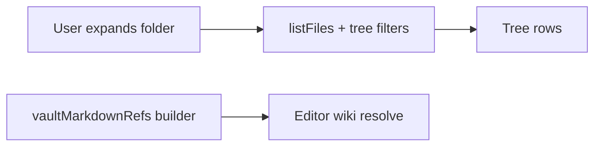

# Desktop companion shell patterns

Conventions for the **primary** Notebox desktop window (`apps/desktop`). Settings and other surfaces may use a **separate Tauri window**; this document is about the main shell.

## Vault tab: tree vs wiki index (two-model rule)

The second **rail** tab is the **Vault** workspace (see **`RailNav`** in **`apps/desktop/src/components/RailNav.tsx`**). Its **left column** is the **vault tree** (**`VaultPaneTree`** in **`apps/desktop/src/components/VaultPaneTree.tsx`**); the **right column** is the **markdown editor** for the selected note (same compose and editing patterns as below).

**Two separate models — do not mix them:**

| Model | Role | Performance |
|--------|------|--------------|
| **Vault tree** | **Lazy and expansion-driven:** each expanded folder loads children with **`listFiles`** plus tree visibility rules (`filterVaultTreeDirEntries` and related helpers in **`@notebox/core`**). | Must stay cheap on expand; no vault-wide crawl in the UI thread for navigation. |
| **Wiki reference index** | **Vault-wide and asynchronous:** flat **`vaultMarkdownRefs`** (`{ name, uri }[]` for eligible `.md` paths), built in the background (`collectVaultMarkdownRefs` in **`useMainWindowWorkspace`**). | Must not block first paint or tree interaction; resolve/autocomplete may be briefly stale until the index catches up. |

- **Do not** drive tree expansion from the wiki index, or walk the whole vault from the tree to serve wiki resolve.
- **Do** use the async index only for resolve, autocomplete, and resolved/unresolved styling in the editor.

Implementation pointers: tree load **`apps/desktop/src/lib/vaultTreeLoadChildren.ts`**; vault markdown refs **`packages/notebox-core/src/vaultMarkdownRefs.ts`**.

## No modal overlays in the main window

Do **not** add **centered dialogs** on a **dimmed full-window backdrop** for flows inside the main UI. Prefer one of:

- **Panes** in the existing resizable layout (for example the Vault tab **Editor** column).
- **Inline** UI in the current view.
- A **secondary window** when a detached surface is genuinely needed.

This avoids focus traps, stacking issues, and keeps behavior aligned with the pane-based layout.

## Vault tab: new log entry (Inbox compose)

Creating a new capture note uses the **same Editor pane UI** as editing (single multiline field + footer primary action), in **compose** mode. New entries are created under the vault **Inbox** using the shared title and filename rules:

- Pane header title: **New entry**.
- Trailing control: **Material `clear`**, ghost icon button (same treatment as **Add entry** in the Vault pane header), to **cancel** compose without saving.
- **Compose model** matches the Android **Add note** screen: the **first line** is the title (drives the **`.md` filename stem** via `sanitizeFileName`, which preserves case and spaces but strips filesystem-dangerous characters); the rest is body. On save, the file is written as `# Title` + body, using **`parseComposeInput`**, **`buildInboxMarkdownFromCompose`**, and related helpers from **`@notebox/core`** (shared with the mobile app).

## Resizable main splits (Vault tab, Podcasts)

The main **horizontal** split is **app-owned** (see **`DesktopHorizontalSplit`** in **`apps/desktop/src/components/DesktopHorizontalSplit.tsx`**), not `react-resizable-panels`: the **left column** uses a **fixed width in CSS pixels** (`flex: 0 0 Npx`); the **right column** uses **`flex: 1`** and absorbs all window-resize remainder. The **separator** uses pointer-drag to change **`leftWidthPx`**, clamped between **`layoutStore`** min/max and the current container width (minimum reserve for the right column via **`minRightPx`**). **`clampSplitLeftWidthPx`** in **`apps/desktop/src/lib/desktopHorizontalSplitClamp.ts`** centralizes that math.

- **Persistence** lives in the Tauri store under **`layoutPanelsV4`** as JSON: `{ "inbox": { "leftWidthPx": number }, "podcastsMain": { "leftWidthPx": number } }`. The key **`inbox`** is a **legacy persistence id** for the Vault tab’s horizontal split; the UI label is **Vault**, not “Inbox tab layout”. Older **`layoutPanelsV3`** percentage layouts are **migrated once** on load (approximate conversion using a fixed assumed width), then removed.
- **Defaults and clamps** are defined next to persistence in **`apps/desktop/src/lib/layoutStore.ts`** (`INBOX_LEFT_PANEL`, `PODCASTS_LEFT_PANEL`).

## Pointer and cursor (desktop app chrome)

The desktop shell is a **native-style app**, not a marketing site. Unless a control has a **special affordance** (for example **panel resize separators** use **`col-resize` / `row-resize`**), chrome **buttons** and **list rows** use the **default arrow** (`cursor: default`). **Disabled** controls keep **muted styling** but **do not** use a “forbidden” cursor; they also use **`cursor: default`**.
