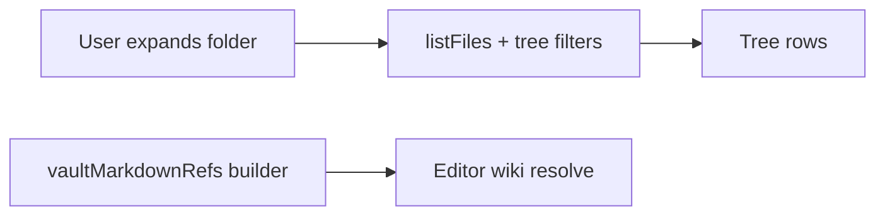

# Desktop companion shell patterns

Conventions for the **primary** Eskerra desktop window (`apps/desktop`). Settings and other surfaces may use a **separate Tauri window**; this document is about the main shell.

## Main workspace: Vault tree, Episodes, editor (two-model rule for the tree)

**Vault** pane visibility is toggled from the **Editor Toolbar** (**`EditorWorkspaceToolbar`**, rendered from **`VaultTab`** — **`apps/desktop/src/components/VaultTab.tsx`**): **leftmost** **`ListBulletIcon`** (**`@radix-ui/react-icons`**, **15×15** in **`pane-header-add-btn__glyph`**), **`pane-header-add-btn` / `icon-btn-ghost`**, with **`pane-header-add-btn--vault-on`** when the tree is visible (**`aria-pressed`**). **`WindowTitleBar`** **leading** (**`apps/desktop/src/components/WindowTitleBar.tsx`**) holds **`TodayHubWorkspaceSelect`** when hub workspaces exist (**`DashboardIcon`** + **`ChevronDownIcon`**, **15×15**): height **`--window-title-bar-chrome-height`**, **tab-pill typography** (`--file-tree-node-*`), **split radii** (**`3px 0 0 3px`** on the main activate control, **`0 3px 3px 0`** on the chevron) so the pair reads as one **select**; **main** **`:hover`** uses **`--color-shell-hover-bg`** and **`--color-shell-icon`**; **chevron** **`:hover`** applies **`--color-shell-hover-bg`** on the chevron only, while **`:has(.today-hub-workspace-select__chevron:hover) .today-hub-workspace-select__main`** keeps the main segment’s background **transparent** but still sets **`--color-shell-icon`** on label and icon. **`:hover`** on the wrapper (**`.today-hub-workspace-select`**) shows a **1px** border around **main + chevron** (default **transparent** border so layout does not shift). **`window-title-bar-leading`** uses **`gap: var(--window-title-bar-vault-workspace-gap)`** (**`4px`**). **`--desktop-leading-track-width`** in **`apps/desktop/src/index.css`** sizes the status bar **leading** grid column so **Episodes** aligns under the title bar **workspace** strip and shell inset. The global **`.rail-tab`** rule (**`App.css`**) remains **40×40** for reuse elsewhere (for example **`TabButton`** in **`apps/desktop/src/ds/TabButton.tsx`**). **Active** **`rail-tab`** uses a **white** icon only (**`#ffffff`**), **no** pill behind it. **Hover** / **focus-visible** (when not **disabled**) uses **`--color-shell-hover-bg`**; **muted** vs **white** icon color does **not** change on hover. **Episodes** pane visibility is toggled from the **leading** slot of **`AppStatusBar`** with the same **`.app-status-bar-icon-tile`** as **Settings** (**`App.css`**, **12px** icon, **`icon-btn-ghost`**); it is **not** a **`rail-tab`** (pressed state is **`aria-pressed`** only). **`main-shell-stage`** (**`App.css`**) keeps **no** horizontal **margin** but uses **symmetric** **`padding-inline: var(--panel-grid-padding)`** for a **thin** left/right gutter inside **`app-body`** (not the old wide leading-track inset). **`app-root-chrome`** uses **`padding-block-start: var(--panel-grid-padding)`** so a band of shell shows above the title bar (and setup / loading shells). **`WindowTitleBar`** uses **`padding: 0 var(--panel-grid-padding)`** so the inset from the window to the **workspace** strip matches **`main-shell-stage`** and the **vertical** band above the panes (**`padding-block`** on **`panel-group.fill`**). **Vault** shows or hides the **vault tree** pane. The **markdown editor** is **always** visible to the right of any visible side columns. When **both** panes are open, **`MainWorkspaceSplit`** (**`apps/desktop/src/components/MainWorkspaceSplit.tsx`**) places **Vault above Episodes** in a single left column using **`DesktopVerticalSplit`** (**`apps/desktop/src/components/DesktopVerticalSplit.tsx`**), then **`DesktopHorizontalSplit`** places that column **left of the editor**. When only one pane is open, a single horizontal split applies. The tree is implemented by **`VaultPaneTree`** (**`apps/desktop/src/components/VaultPaneTree.tsx`**); episode rows use **`EpisodesPane`** (**`apps/desktop/src/components/EpisodesPane.tsx`**). Podcast catalog loading runs in **`useDesktopPodcastCatalog`** so playback works even when the Episodes pane is hidden.

**Two separate models — do not mix them:**

| Model | Role | Performance |
|--------|------|--------------|
| **Vault tree** | **Lazy and expansion-driven:** each expanded folder loads children with **`listFiles`** plus tree visibility rules (`filterVaultTreeDirEntries` and related helpers in **`@eskerra/core`**). | Must stay cheap on expand; no vault-wide crawl in the UI thread for navigation. |
| **Wiki reference index** | **Vault-wide and asynchronous:** flat **`vaultMarkdownRefs`** (`{ name, uri }[]` for eligible `.md` paths), built in the background (`collectVaultMarkdownRefs` in **`useMainWindowWorkspace`**). | Must not block first paint or tree interaction; resolve/autocomplete may be briefly stale until the index catches up. |

- **Do not** drive tree expansion from the wiki index, or walk the whole vault from the tree to serve wiki resolve.
- **Do** use the async index only for resolve, autocomplete, and resolved/unresolved styling in the editor.

Implementation pointers: tree load **`apps/desktop/src/lib/vaultTreeLoadChildren.ts`**; vault markdown refs **`packages/eskerra-core/src/vaultMarkdownRefs.ts`**.

### Full vault content search (indexed, note-first)

- **Shortcut:** **Ctrl+Shift+F** (Windows/Linux) or **Cmd+Shift+F** (macOS) opens **`VaultSearchPalette`** (**`apps/desktop/src/components/VaultSearchPalette.tsx`**). While this palette or **Quick Open** is open, the other shortcut sequence does not open the sibling palette.
- **Scope:** Eligible **`.md`** files only, with **strict parity** to the vault tree listing rules in **`vaultVisibility.ts`** and **`vaultLayout.ts`** (ignored names, hard-excluded directories `Assets` / `Excalidraw` / `Scripts` / `Templates`, sync-conflict filenames, `.md` eligibility). When those rules change, update **`apps/desktop/src-tauri/src/vault_search.rs`**, **`vault_search_index.rs`**, and parity tests **in the same change**.
- **No first-paint block:** After **`vault_set_session`** and **`vault_start_watch`**, the UI calls **`vault_search_index_schedule`** on a **`queueMicrotask`** so the **Tantivy** full build runs in Rust **without blocking** React first paint. **`vault-files-changed`** batches call **`vault_search_index_touch_paths`** with the watcher’s absolute paths for **incremental** reindex. Search runs are cheap once the index is **`ready`**; until then **`vault_search_start`** returns **no note rows** and **`progress.indexReady`** is false.
- **Protocol:** The UI generates a **`searchId`** (UUID) per run and passes it to **`vault_search_start`**. Tauri emits **`vault-search:update`** (**note-level** results: **`notes`** plus **`progress`**) and **`vault-search:done`**. **`progress`** includes **`indexStatus`** (`ready` \| `building` \| `failed` \| `idle` \| `unavailable`) and **`indexReady`**. The UI applies **`update`** / **`done`** only when **`payload.searchId`** matches the **current** in-flight run’s id (**`useVaultContentSearch`**). Do **not** add extra client-side filtering (e.g. comparing the input string to the payload) — correctness is **`searchId`** ownership only.
- **UI session (debounce vs run):** On each non-empty query change, the hook clears the active **`searchId`**, calls **`vault_search_cancel`**, and arms a **trailing** debounce (**300 ms**). **Prior `notes`** stay visible until that timer fires; during this debounce window the status line keeps the last **`Searched …`** summary when available (and never shows a premature **`Searching…`**). After idle, the hook assigns a **new** **`searchId`**, sets **`scanDone`** false, then **`vault_search_cancel`** + **`vault_search_start`**. If there were **no** prior notes, it clears **`notes`** and **`progress`** immediately; if there **were** prior notes, it keeps them on screen for up to **~100 ms** (**`holdingPreviousResults`** / **`PREVIOUS_RESULTS_HOLD_MS`**) until the first **`vault-search:update`** for the new run, **`vault-search:done`**, or the hold timeout—whichever comes first—then clears stale rows if the backend was still quiet. **`Searching…`** is shown only if the active run is still in progress **~100 ms** after **`scanDone`** became false (**`searchingStatusVisible`**); faster runs skip the label to avoid flicker. **`Searched …`** appears after **`done`** for that **`searchId`**. The list empty-state does not duplicate the status line.
- **Main-thread responsiveness:** **`vault-search:update`** writes the latest **`notes`** into a ref and flushes to React on **`requestAnimationFrame`** (at most about **one** `setNotes` / **`setProgress`** pass per frame). **`VaultSearchPalette`** sorts the **full** note list (score / best field / uri), then renders at most **100** rows; when more matches exist, a footer line states **Showing 100 of N notes**.
- **Ranking / snippets:** One **Tantivy** document per note (title stem, filename, relative path, body). **Title/path** matches are boosted over **body**. Query parsing uses **exact + fuzzy term** composition per token. Snippets (**max 3** per note) are **single-line**, trimmed, max **160** Unicode scalars, with **bounded Levenshtein** token checks aligned with **`vault_search.rs`** helpers for body preview. Files larger than **512 KiB (524288 bytes)** are indexed with an **empty body** (same cap as the old scan); snippet collection still respects line limits.
- **Events:** Optional **`vault-search:index-status`** JSON for UI (“building” / “ready” / “failed”); the search palette primarily relies on **`progress.indexStatus`** on each search result.
- **Note `uri`:** Absolute filesystem path string, same form as **`VaultDirEntryDto.uri`** from **`vault_list_dir`** (what **`openMarkdownInEditor`** / **`selectNote`** already expect).

### Quick Open (Shift-Shift) and shared palette typography

**`QuickOpenNotePalette`** and **`VaultSearchPalette`** share **`Dialog.Content`** styling via **`.quick-open-content`** and the **`cmdk`** row classes (**`.quick-open-command__item-title`** / **`__item-path`**). On **WebKitGTK**, path and snippet lines must use the same **UI sans + smoothing** rules as the shell container, or secondary text looks **jagged** next to titles. **Authoritative checklist:** **Command palettes** section in [`desktop-text-rendering.md`](desktop-text-rendering.md). **Do not** put smoothing rules only on **`.vault-search-content`** (that class is for **layout** overrides such as **`max-height`**, not an alternate typography stack).

### Vault tree vs. open note (manual reveal)

The vault tree **does not** follow the editor: changing the active note (tabs, wiki navigation, etc.) **must not** auto-expand folders or move tree selection. Expansion and selection are **user-owned** until explicitly synced.

To locate the current note, use **Show active note in tree** in the **Vault** pane header (`location_searching` in **`VaultTreePane`**, beside **Add entry**). That bumps **`revealActiveNoteNonce`** in **`VaultTab`**, which **`VaultPaneTree`** handles by loading ancestors, expanding the path, selecting the correct row (including Today hub directory rows), focusing it, and scrolling it into view in the virtual list.

### Open note tabs (title bar)

Editor **open-note tabs** are **`EditorPaneOpenNoteTabs`** (**`apps/desktop/src/components/EditorPaneOpenNoteTabs.tsx`**), rendered into **`WindowTitleBar`** with **`createPortal`** from **`VaultTab`** (**`titleBarEditorTabsHost`** on **`VaultTab`**, **`onEditorTabsHostRef`** on **`WindowTitleBar`**, **`App.tsx`** holds the host **`useState`**). Title bar order: **leading** (Today hub **workspace** select when present) | **`window-title-editor-tabs-host`** | **`window-title-bar-drag-sliver`** (no buttons; **`data-tauri-drag-region`** for predictable window drag) | **minimize/close**. **`editor-open-tabs-scroll--titlebar`** in **`App.css`**: one row, flex shrink to a fixed **minimum** tab width (icon + close + padding), then **clip** (no second line, no horizontal scroll). A trailing **`editor-open-tabs-titlebar-drag-filler`** flex child (plus **`-webkit-app-region: drag`** on the host, strip, and title-bar tab row under **`.app-root--tauri`**) makes **empty horizontal space** window-draggable. With **no** open tabs, the host shows **no** placeholder label (strip + drag filler only). **Tab pills** use **`no-drag`** so clicks and context menus still work. **Inactive** tab **pills** get a **1px** hover / focus-within **`border-color`** matching **`.today-hub-workspace-select:hover`** (same **`color-mix`** token in **`App.css`**). **Reorder:** drag a tab (pointer threshold) to move it; **`reorderEditorWorkspaceTabs`** in **`useMainWindowWorkspace`** updates order; **`EditorPaneOpenNoteTabs`** shows a **drop indicator** line and a **ghost** label while dragging.

### Editor Toolbar

The **Editor Toolbar** is a **full-width** chrome row **above** the combined main workspace (**Vault** / **Episodes** / **editor** via **`MainWorkspaceSplit`**) **and** the **Notifications** column. It lives in **`EditorWorkspaceToolbar`** (**`apps/desktop/src/components/EditorWorkspaceToolbar.tsx`**), rendered from **`VaultTab`** (**`apps/desktop/src/components/VaultTab.tsx`**) inside **`inbox-root`**, **before** **`DesktopHorizontalSplitEnd`**, so opening or resizing the notifications pane does **not** shrink the toolbar horizontally. Controls: **Vault** (**`ListBulletIcon`**, Radix **15×15**), **Back / Forward** (**`ChevronLeftIcon` / `ChevronRightIcon`**), the **New entry** title when composing, **Cancel** when composing (**`Cross2Icon`**), and a **trailing notifications** toggle (**`BellIcon`**); all use **`pane-header-add-btn__glyph`** at **15×15** and **`pane-header-add-btn` / `icon-btn-ghost`**. Markup: **`pane-header pane-header--editor-toolbar`** (plus **`editor-workspace-toolbar`** on the root). Styles: **`.pane-header--editor-toolbar`**, **`.pane-header-add-btn`**, and pressed accents (**`--vault-on`**, **`--notifications-on`**) in **`App.css`**. Open-note **tabs** are **not** in this row (they render in **`WindowTitleBar`**; see **Open note tabs (title bar)** above).

## Today hub directories (vault tree + editor paper)

When a vault **directory** **directly contains** an eligible markdown file named exactly **`Today.md`** (same visibility filters as `loadVaultTreeVisibleChildRows` in **`apps/desktop/src/lib/vaultTreeLoadChildren.ts`>), the tree shows **one row for that directory**: Lucide **`calendar-range`** (24px, matches default 24 viewBox for crisp strokes) in the vault tree row, label = **directory name**, **no expand chevron** (leaf-like; not expandable). **Opening** **`{directory}/Today.md`** uses the same IDE-style pattern as other tree notes: **double-click** the row or press **Enter** while the row is focused (single click only **selects**). Context menu **Open** still opens the hub note. **`Today.md` is not listed** under that folder in the tree. Other files that live only inside that directory are **not** surfaced as child rows (no expand). Sibling entries **at the same parent** as that directory still list normally. Use **Show active note in tree** to select the **directory** row (item id = directory URI) when the hub note is open. Drag-and-drop, rename, and delete on that row treat it like a **folder**. Listing a parent directory performs an extra `listFiles` per visible subdirectory to classify hubs (parallelized). Under one parent, rows sort as **Today hub directories** (A–Z), then **other folders** (A–Z), then **markdown files** (A–Z).

**Tab pill labels** for **`Today.md`** use the parent folder name and the **`today`** icon treatment (`editorOpenTabPillLabel` / `editorOpenTabPillIconName`). In the **vault tree**, hub rows and eligible **`Today.md`** article rows use the **`calendar-range`** Lucide icon (see **`FileTreeNode`**). Standalone **`Today.md`** article rows match that tree treatment when shown as file rows.

### Today hub canvas (weekly columns)

When the open note is **`Today.md`** (`vaultUriIsTodayMarkdownFile` in **`apps/desktop/src/lib/vaultTreeLoadChildren.ts`**), **`VaultTab`** shows a **weekly canvas** below the main CodeMirror: **`TodayHubCanvas`** in **`apps/desktop/src/components/TodayHubCanvas.tsx`**. The **Linked from** (inbox backlinks) section is **not** shown for that note; it still appears for all other open markdown notes.

- **Placement (not on the white paper):** **`EditorPaneBody`** renders the hub in a **second** **`note-markdown-editor-page`** row directly under the scroll’s first row (fold rail + **`note-markdown-editor-paper`** with CodeMirror only). The hub lives in **`note-markdown-editor-paper--today-hub-shell`**: **transparent** background and **no** paper shadow. With **`note-markdown-editor-scroll--today-hub`**, the **first** editor **`note-markdown-editor-paper`** has **no `box-shadow` and no border** — any **full-height side frame** would still read as one continuous edge through the hub. Week rows use **lighter gray date strips** (**`.today-hub-canvas__row-date-bar`**: **`color-mix`** of **`--nb-editor-margin-bg`** toward **`--nb-editor-paper`**) **above and below** the cell grid (**`.today-hub-canvas__row-date-bar--footer`** is **end-aligned** for the week’s last day); **white cells** (**`.today-hub-canvas__cell`**, square corners) only; there is **no** extra **`box-shadow`** on **`.today-hub-canvas__row-cells`**. **`App.css`** gives each date bar **negative inline-end margin / extra width** so the band spans the hub column (cancelling **`today-hub-canvas`** and row right padding). **Even-week zebra** applies only to **`.today-hub-canvas__row-cells`**. With the hub open, **`note-markdown-editor-scroll--today-hub`** sets **`flex: 0 0 auto`** on **both** page rows so the hub is not pushed down by an empty flex-grown paper strip.
- **Hub configuration** is read from optional YAML **frontmatter** on **`Today.md`**: `perpetualType: weekly` (only weekly is implemented), `start:` as a **full English weekday** in lowercase (for example `monday`, `saturday`; default `monday`) determining which **local-calendar day** begins each hub week, and `columns:` as a list of extra column titles (for example `- Next actions`). The main editor column is always the **default** column; each `columns` entry adds one more column to the grid. If `columns` is empty, the canvas is a single column.
- **Row files** live in the **same directory** as **`Today.md`**, named by **local-calendar `YYYY-MM-DD.md`** where the date is the **first day** of that hub week (per `start:`). The canvas shows **53 consecutive week starts** beginning at that weekday in the **previous calendar week**, then stepping +7 days (see **`enumerateTodayHubWeekStarts`** in **`apps/desktop/src/lib/todayHub/`**; **`enumerateTodayHubMondays`** is the `start: monday` case). Each row’s **top** **`.today-hub-canvas__row-date-bar`** contains **`.today-hub-canvas__row-date-bar-cols`**, a grid with the **same** **`grid-template-columns`** and **`gap`** as **`.today-hub-canvas__row-cells`** (and **`width: calc(100% - (20px + 56px + 22px))`** so tracks line up with the cells despite the bar’s extra bleed width): the **first** track shows the **week start** (**`.today-hub-canvas__row-date`**, full weekday + month + day, **runtime locale**); **additional** tracks show **column titles** (**`.today-hub-canvas__col-head`**, from frontmatter **`columns:`**, uppercase muted). **`.today-hub-canvas__row-date`** and **`col-head`** use **`padding-inline-start: var(--today-hub-header-pad-inline-start)`** (**`calc(var(--today-hub-body-pad-inline-start) + 0.8em)`** on **`.today-hub-canvas__row`**, editor-sized **`em`**) so labels line up with list/paragraph text after **`cm-md-list-mark`** spacing; hub cells and **`.cm-content`** still use **`--today-hub-body-pad-inline-start`**, including the **empty-cell** dotted frame (**`::before`** on **`.today-hub-canvas__cell--empty-readonly`**) so the placeholder aligns with body text, not the title-only inset. There is **no** separate global **Weeks** header. The **bottom** bar shows the **inclusive week end** from **`todayHubWeekEndInclusive`**, same date format, **right-aligned** in **`App.css`**. The **first** row (previous week) uses **`today-hub-canvas__row--previous-week`** in **`App.css`**: the **cell grid** uses **`opacity: 0.67`** and **`filter: grayscale(1)`**; **`.today-hub-canvas__row-date`**, **`.col-head`**, and footer **`.today-hub-canvas__row-date-end`** keep **`--today-hub-chrome-label-color`** like other rows (no extra fade on the strip); only **`.today-hub-canvas__row-cells`** is de-emphasized, avoiding row-level opacity on labels for compositing AA.
- **Multi-column file body:** segments are separated by a blank line, the line **`::today-section::`**, and another blank line (`\n\n::today-section::\n\n`). **`splitTodayRowIntoColumns`** also accepts EOF immediately after the marker missing a final blank line, a single newline before the marker (when a paragraph break was intended but only one newline was typed), and optional spaces around the marker line. Round-trip **`mergeTodayRowColumns`** still writes the canonical delimiter. Helpers live in **`splitMergeTodayRowColumns.ts`**. After splitting, **lines that contain only** `::today-section::` (optional spaces) are removed from each column body so malformed or duplicated delimiters never appear in hub cell editors.
- **Lazy I/O:** row files are **prehydrated** from disk into **`inboxContentByUri`** when the hub opens; a file is **created on first save** when any column has non-whitespace content. If **all** columns are blank after an edit, the row file is **deleted** and the cache entry removed.
- **Editing:** one cell at a time opens a full **`NoteMarkdownEditor`**; inactive cells show read-only text. **Escape** closes the active cell after flushing the debounced save. For a cell that was **empty** when opened, **blur** (focus leaving the editor) also closes it and restores the **dashed empty placeholder**, as long as the document is still whitespace-only (**`onEditableBlur`** in **`NoteMarkdownEditor`**, **`closeEmptyActiveCellIfStillEmpty`** in **`TodayHubCanvas`**); cells that already had content keep today’s behavior (blur does not exit edit mode). Hub row saves use **`persistTransientMarkdownImages`** and **`saveNoteMarkdown`** (see **`persistTodayHubRow`** in **`useMainWindowWorkspace.ts`**) and update **`inboxContentByUri`** like other notes. **`vault-files-changed`** reconcile refreshes cached row bodies when **`Today.md`** is open, except the row currently being edited in the hub (external edits to that file may not apply until the cell is closed).
- While the Today hub canvas is visible, **new** wiki links and relative `.md` targets are created under **`General/`** (same rule for the main `Today.md` editor and hub cells). **Opening** an existing note still follows the vault index. Implementation: `showTodayHubCanvasRef` + `getGeneralDirectoryUri` in the workspace hook; `todayHubWikiNavParentRef` / `todayHubCellEditorRef` remain used for in-editor link fixes (canonical inner/href) when the active surface is a hub cell.

## No modal overlays in the main window

Do **not** add **centered dialogs** on a **dimmed full-window backdrop** for flows inside the main UI. Prefer one of:

- **Panes** in the existing resizable layout (for example the **Editor** column next to optional Vault / Episodes panes).
- **Inline** UI in the current view.
- A **secondary window** when a detached surface is genuinely needed.

This avoids focus traps, stacking issues, and keeps behavior aligned with the pane-based layout.

## Vault workspace: new log entry (Inbox compose)

Creating a new capture note uses the **same Editor pane UI** as editing (single multiline field + footer primary action), in **compose** mode. New entries are created under the vault **Inbox** using the shared title and filename rules:

- **Editor Toolbar** title: **New entry**.
- **Cancel** (before the notifications toggle on the trailing side): **Radix `Cross2Icon`** (**15×15**), ghost **`pane-header-add-btn`**, to **cancel** compose without saving.
- **Compose model** matches the Android **Add note** screen: the **first line** is the title (drives the **`.md` filename stem** via `sanitizeFileName`, which preserves case and spaces but strips filesystem-dangerous characters); the rest is body. On save, the file is written as `# Title` + body, using **`parseComposeInput`**, **`buildInboxMarkdownFromCompose`**, and related helpers from **`@eskerra/core`** (shared with the mobile app).

## Vault workspace: editor tabs (title bar + model)

When **not** composing a new entry, **open-note tabs** render in the **window title bar** (see **Open note tabs (title bar)** above): **`EditorPaneOpenNoteTabs`** is portaled from **`VaultTab`** into **`WindowTitleBar`**. The **Editor Toolbar** holds **Vault**, **Back / Forward**, and the **notifications** toggle (**trailing**). Each pill is a **stable tab id**; its label reflects the tab’s **current** note URI (after in-tab navigation). Each pill’s **main strip** activates that tab; the **×** closes it; **right-click** opens a **Radix context menu** with **Rename note** (current URI), **Close tab**, and **Close other tabs**. **Drag-reorder** (pointer threshold, then move) calls **`reorderEditorWorkspaceTabs`**; a **vertical drop indicator** and **ghost** label show the insertion point while dragging.

- **Back / Forward** (chevrons and mouse X1/X2 via **`useEditorHistoryMouseButtons`**) apply to the **active tab only**: each tab has its own **`EditorDocumentHistoryState`** (**`editorWorkspaceTabs`** in **`useMainWindowWorkspace`**). Following a wiki or relative vault link in the main editor **navigates within the active tab** (pushes that tab’s history) and **does not** open a new pill. **Middle-click** on those same vault links opens the target in a **new background tab** (new pill without stealing focus). External **`http` / `https` / `mailto`** targets are unchanged (system browser); middle-click on external wiki targets does not open a background vault tab.
- **Open tabs** are **`editorWorkspaceTabs`**: **`{ id, history }`** entries. Session persistence uses **`inbox.editorWorkspaceTabs`** and **`inbox.activeEditorTabId`** when present; legacy **`inbox.openTabUris`** is still written as the list of **current** URIs for backward compatibility and migrated on restore when the new fields are absent.
- **Reopen closed tab:** while a vault is open, **Ctrl+Shift+T** (Linux/Windows) or **Cmd+Shift+T** (macOS) calls **`reopenLastClosedEditorTab`** when reopen is available (**`App.tsx`** listens with **`canReopenClosedEditorTabRef`**). **Reopen** uses an **in-memory LIFO stack** of URIs closed via explicit UI actions (**`editorClosedTabsStackRef`** in **`useMainWindowWorkspace`**); **vault hydrate** clears that stack. **Deletes**, **bulk/tree removals**, and similar **do not** enqueue reopen targets. **`reopenLastClosedEditorTab`** skips stack entries that are no longer openable (same vault-path checks as session restore) until it finds a valid note or the stack is empty. **`closeAllEditorTabs`** remains on the workspace hook for programmatic use; there is **no** toolbar menu for it in the main window.
- **Compose mode** does not portal tabs into the title bar (that slot is empty) and shows the **New entry** title in the **Editor Toolbar** only (tab list stays in memory until compose ends).
- **Persistence**: **`mainWindowUiV1`** **`inbox`** (**`apps/desktop/src/lib/mainWindowUiStore.ts`**) stores **`editorWorkspaceTabs`**, **`activeEditorTabId`**, **`selectedUri`**, and derived **`openTabUris`**. Restore **filters** paths that still look valid for the vault; if **`selectedUri`** fails validation, the first remaining tab’s current URI is opened when possible.

## Resizable main splits (Vault, Episodes, editor, Notifications)

The main **horizontal** split is **app-owned** (see **`DesktopHorizontalSplit`** in **`apps/desktop/src/components/DesktopHorizontalSplit.tsx`**), not `react-resizable-panels`: the **left column** uses a **fixed width in CSS pixels** (`flex: 0 0 Npx`); the **right column** uses **`flex: 1`** and absorbs all window-resize remainder. The **separator** uses pointer-drag to change **`leftWidthPx`**, clamped between **`layoutStore`** min/max and the current container width (minimum reserve for the right column via **`minRightPx`**). **`clampSplitLeftWidthPx`** in **`apps/desktop/src/lib/desktopHorizontalSplitClamp.ts`** centralizes that math. When **Vault** and **Episodes** are both visible, a **`DesktopVerticalSplit`** stacks them in that left column; its **top pane height** is **`topHeightPx`**, adjusted with **`clampSplitTopHeightPx`** (**`apps/desktop/src/lib/desktopVerticalSplitClamp.ts`**). When only one side pane is visible, a single horizontal split matches the Vault-only or Episodes-only layouts.

- **Persistence** lives in the Tauri store under **`layoutPanelsV4`** as JSON: `{ "inbox": { "leftWidthPx": number }, "podcastsMain": { "leftWidthPx": number }, "notifications": { "widthPx": number }, "vaultEpisodesStack": { "topHeightPx": number } }`. **`inbox.leftWidthPx`** and **`podcastsMain.leftWidthPx`** always hold the **same** value: one **main left pane width** for Vault-only, Episodes-only, or the stacked pair (legacy dual keys). On load, if older JSON had different numbers, the **larger** of the two is taken, then clamped. **`vaultEpisodesStack.topHeightPx`** is the **Vault** pane height in the vertical stack when both panes are visible. Older **`layoutPanelsV3`** percentage layouts are **migrated once** on load (approximate conversion using a fixed assumed width), then removed. If **`notifications`** or **`vaultEpisodesStack`** is missing in stored v4 JSON, it defaults on load.
- **Defaults and clamps** are defined next to persistence in **`apps/desktop/src/lib/layoutStore.ts`** (`INBOX_LEFT_PANEL`, `PODCASTS_LEFT_PANEL`, **`NOTIFICATIONS_PANEL`**, **`VAULT_EPISODES_STACK_TOP`**).

The **main column + Notifications pane** share the same outer **`panel-group fill`** chrome as the inner workspace splits (see **`main-shell-stage`** in **`apps/desktop/src/App.tsx`**). **`DesktopHorizontalSplitEnd`** (**`apps/desktop/src/components/DesktopHorizontalSplitEnd.tsx`**) is composed **inside** **`VaultTab`** (**below** the Editor Toolbar): **flex main** (**`MainWorkspaceSplit`**) | **separator** | **fixed-width Notifications** (**`NotificationsPanel`**). Dragging the separator updates **`notifications.widthPx`** (clamped by **`clampSplitRightWidthPx`** in **`desktopHorizontalSplitClamp.ts`**). Inner workspace splits use **`className="split-inner"`** so **`panel-group fill`** padding is not applied twice. Workspace splits use **`resize-sep--canvas`** for a **hairline** separator between panes (see **`App.css`**).

- **Pane corners:** The **main workspace** (**`.main-workspace-canvas`** in **`VaultTab`**, wrapping the Editor Toolbar + **`DesktopHorizontalSplitEnd`**) uses **`border-radius: var(--window-radius)`** and **`overflow: hidden`** so the **whole** canvas reads as one rounded rectangle; inner **`.panel-surface`** regions stay square and clip to that shell. Primary in-pane list rows (**vault** tree, **Episodes**, **Notifications**, editor **Linked from** / note-list, **Today hub** cells, vault drag ghost) use **`border-radius: 0`** in **`App.css`** / **`FileTreeNode.module.css`**. Workspace **`.resize-sep--canvas`** drag lines use **`var(--color-capture-border)`** to match capture pane header divider color. Dialogs, palettes, and title bar controls may still use their own radii.

**Rail pane visibility** is persisted in **`mainWindowUiV1`** as **`vaultPaneVisible`** and **`episodesPaneVisible`** (replacing the former single **`mainTab`** field; legacy payloads migrate on load).

The generic **`.panel-group.fill`** rule uses **asymmetric** horizontal inset (`padding-inline-start` at **0.75×** `--panel-grid-padding`, `padding-inline-end` at **1×**) for inner split balance. **`main-shell-stage.panel-group.fill`** sets **`margin-inline: 0`** and **symmetric** **`padding-inline: var(--panel-grid-padding)`** for a minimal outer gutter; vertical inset still comes from the shared **`.panel-group.fill`** **`padding-block`** rule.

## Main shell status bar and disk conflict strip

The bottom **`AppStatusBar`** (**`apps/desktop/src/components/AppStatusBar.tsx`**) uses a **three-column** row: **Episodes** (**leading**, first grid column **`var(--desktop-leading-track-width)`**, aligned under the title bar **workspace** strip and shell inset), a **center column** (stacked content), and **Settings** (**trailing**). **Episodes** and **Settings** share **`.app-status-bar-icon-tile`**. The **center column** is a **vertical stack**: when an episode is active, **full playback chrome** (**elapsed time**, **rewind 10s**, **play/pause**, **forward 10s**, **duration**) from **`PlaybackTransport`** (**`apps/desktop/src/components/PlaybackTransport.tsx`**) sits **above** the second line; **transient error/info chips** or **tagline/podcast** text occupy the **second line** only. Playback controls stay visible above a **message chip** when both apply (parity with the former title-bar transport + status text split).

The **second line** is chosen by **`resolveAppStatusBarCenter`** (**`apps/desktop/src/lib/resolveAppStatusBarCenter.ts`**) with this **priority** (highest wins):

1. **Transient messages**: global **`err`**, then **rename link progress**, then **wiki rename notice**. While a **disk conflict** (blocking or soft) is active, rename/wiki lines are suppressed so the bar can show the tagline or podcast line instead; **`err`** still wins when set.
2. **Podcast** line (episode title and series name) when playback is **playing**, **paused**, or **loading** and an active episode exists.
3. Default **tagline** (`APP_SHELL_TAGLINE`).

Transient **error** and **info** lines appear as a **centered chip** (rounded pill with background, border, and optional leading icon) in **[`AppStatusBar`](../../apps/desktop/src/components/AppStatusBar.tsx)**, using **`--color-shell-status-*`** tokens in [`index.css`](../../apps/desktop/src/index.css) aligned with **`.error-banner`** / **`.info-banner`** — not bare text on the chrome gradient.

**Disk conflict** UIs (blocking and soft, with primary/secondary actions) render as **inline strips** between **`app-body`** and **`AppStatusBar`**, not under the window title bar. They reuse the existing **`conflict-banner`** / **`info-banner--inline-actions`** styles; they are not centered modals on a dimmed backdrop.

## Notifications panel (main window)

The main shell **`app-body`** row is a single **`main-shell-stage`** (**`panel-group fill`** with **`DesktopHorizontalSplitEnd`**: **`main-column`** | optional separator + Notifications pane). There is **no** separate left or right **icon rail** column in the body. **`notificationsPanelVisible`** is toggled from the **Editor Toolbar** in **`VaultTab`** (**trailing** **`BellIcon`**, compact **`pane-header-add-btn`**), and is persisted in **`mainWindowUiV1`** (**`notificationsPanelVisible`**). **`vaultPaneVisible`** is toggled from the **Editor Toolbar** (**Vault** control); **`episodesPaneVisible`** is controlled from **`AppStatusBar`** (both persist in **`mainWindowUiV1`**).

The **Notifications** list is **session-only** (in-memory React state). It is **not** persisted across restarts. **Sources** include: (1) **`AppStatusBarCenter`** messages from **`resolveAppStatusBarCenter`** (errors, rename link progress with in-place updates, wiki notices); (2) one-time rows when the **blocking** or **soft disk conflict** strips first appear. **Dismiss** removes a row and **does not** clear global app state (for example **`err`**). **Clear all** clears the list only.

When a **status message** is truncated in the bar (**ellipsis**), a **Read more** control opens the pane and **highlights** the matching row (see **`AppStatusBar`**). Short messages do not show **Read more** but still accumulate in the Notifications list.

## Pointer and cursor (desktop app chrome)

The desktop shell is a **native-style app**, not a marketing site. Unless a control has a **special affordance** (for example **panel resize separators** use **`col-resize` / `row-resize`**), chrome **buttons** and **list rows** use the **default arrow** (`cursor: default`). **Disabled** controls keep **muted styling** but **do not** use a “forbidden” cursor; they also use **`cursor: default`**.

**Exception — Today Hub read-only cell preview:** **`.today-hub-canvas__cell-readonly`** and **`.today-hub-canvas__cell-static-rich`** use **`cursor: text`** so the inactive cell reads as body copy that opens into the editor; vault links in the static preview still use **`cursor: pointer`** from shared markdown token rules.
