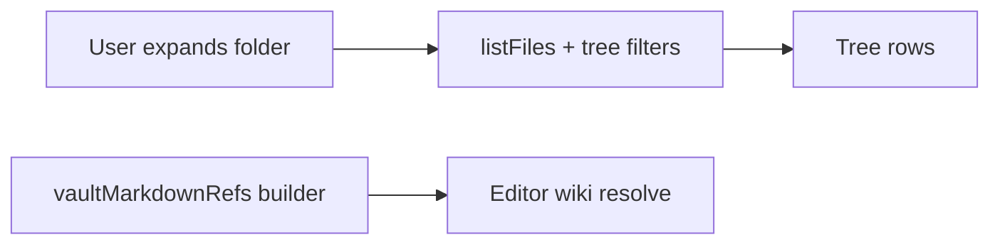

# Desktop companion shell patterns

Conventions for the **primary** Eskerra desktop window (`apps/desktop`). Settings and other surfaces may use a **separate Tauri window**; this document is about the main shell.

## Vault tab: tree vs wiki index (two-model rule)

The second **rail** tab is the **Vault** workspace (see **`RailNav`** in **`apps/desktop/src/components/RailNav.tsx`**). Its **left column** is the **vault tree** (**`VaultPaneTree`** in **`apps/desktop/src/components/VaultPaneTree.tsx`**); the **right column** is the **markdown editor** for the selected note (same compose and editing patterns as below).

**Two separate models — do not mix them:**

| Model | Role | Performance |
|--------|------|--------------|
| **Vault tree** | **Lazy and expansion-driven:** each expanded folder loads children with **`listFiles`** plus tree visibility rules (`filterVaultTreeDirEntries` and related helpers in **`@eskerra/core`**). | Must stay cheap on expand; no vault-wide crawl in the UI thread for navigation. |
| **Wiki reference index** | **Vault-wide and asynchronous:** flat **`vaultMarkdownRefs`** (`{ name, uri }[]` for eligible `.md` paths), built in the background (`collectVaultMarkdownRefs` in **`useMainWindowWorkspace`**). | Must not block first paint or tree interaction; resolve/autocomplete may be briefly stale until the index catches up. |

- **Do not** drive tree expansion from the wiki index, or walk the whole vault from the tree to serve wiki resolve.
- **Do** use the async index only for resolve, autocomplete, and resolved/unresolved styling in the editor.

Implementation pointers: tree load **`apps/desktop/src/lib/vaultTreeLoadChildren.ts`**; vault markdown refs **`packages/eskerra-core/src/vaultMarkdownRefs.ts`**.

## No modal overlays in the main window

Do **not** add **centered dialogs** on a **dimmed full-window backdrop** for flows inside the main UI. Prefer one of:

- **Panes** in the existing resizable layout (for example the Vault tab **Editor** column).
- **Inline** UI in the current view.
- A **secondary window** when a detached surface is genuinely needed.

This avoids focus traps, stacking issues, and keeps behavior aligned with the pane-based layout.

## Vault tab: new log entry (Inbox compose)

Creating a new capture note uses the **same Editor pane UI** as editing (single multiline field + footer primary action), in **compose** mode. New entries are created under the vault **Inbox** using the shared title and filename rules:

- Pane header title: **New entry**.
- Trailing control: **Material `clear`**, ghost icon button (same treatment as **Add entry** in the Vault pane header), to **cancel** compose without saving.
- **Compose model** matches the Android **Add note** screen: the **first line** is the title (drives the **`.md` filename stem** via `sanitizeFileName`, which preserves case and spaces but strips filesystem-dangerous characters); the rest is body. On save, the file is written as `# Title` + body, using **`parseComposeInput`**, **`buildInboxMarkdownFromCompose`**, and related helpers from **`@eskerra/core`** (shared with the mobile app).

## Vault tab: editor open-note pills (tabs)

When **not** composing a new entry, the **editor pane header** (**`VaultTab`**, right column) shows a **horizontally scrollable** row of **pills** for **open markdown notes** (**`EditorPaneOpenNoteTabs`** in **`apps/desktop/src/components/EditorPaneOpenNoteTabs.tsx`**). Each pill’s **main strip** switches the active note; the **×** closes that tab without affecting other open notes; **right-click** (long-press where applicable) on a pill opens a **Radix context menu** with **Rename note**, **Close tab**, and **Close other tabs** (scoped to that pill’s URI).

- **Back / Forward** (chevrons) stay at the **start** of the header; they drive **`editorDocumentHistory`** in **`useMainWindowWorkspace`** — a **linear browser-style stack** (opening a note after navigating back **truncates forward** entries). That behavior is **unchanged**.
- **Open tabs** are a **separate ordered list** (**`editorOpenTabUris`**) maintained in **`useMainWindowWorkspace`**: opening a note from the tree or links **adds** it if missing; closing a tab **removes** it; renames/moves/deletes **remap or prune** tab URIs like **`editorDocumentHistory`**. Do not conflate the two models in new code.
- **Trailing menu** (header **`more_vert`**): when not composing, shown if there is **at least one open tab** or a **reopen** is possible. It offers **Close all** and **Reopen closed tab** only (the latter shows **Ctrl+Shift+T** on Linux/Windows and **⌘⇧T** on macOS in the menu). The same shortcut is handled globally while the **Vault** rail tab is active and a vault is open: **Ctrl+Shift+T** / **Cmd+Shift+T** calls **`reopenLastClosedEditorTab`** when reopen is available. **Reopen** uses an **in-memory LIFO stack** of URIs closed via explicit UI actions (**`editorClosedTabsStackRef`** in **`useMainWindowWorkspace`**); **vault hydrate** clears that stack. **Deletes**, **bulk/tree removals**, and similar **do not** enqueue reopen targets. **`reopenLastClosedEditorTab`** skips stack entries that are no longer openable (same vault-path checks as session restore) until it finds a valid note or the stack is empty.
- **Compose mode** hides the pill strip and shows the **New entry** title only (tab list stays in memory until compose ends).
- **Persistence**: **`inbox.openTabUris`** in **`mainWindowUiV1`** (**`apps/desktop/src/lib/mainWindowUiStore.ts`**), saved from **`App.tsx`** with **`selectedUri`**. Restore **filters** stored URIs to paths that still look valid for the vault; if **`selectedUri`** fails validation, the first remaining tab is opened when possible.

## Resizable main splits (Vault tab, Podcasts)

The main **horizontal** split is **app-owned** (see **`DesktopHorizontalSplit`** in **`apps/desktop/src/components/DesktopHorizontalSplit.tsx`**), not `react-resizable-panels`: the **left column** uses a **fixed width in CSS pixels** (`flex: 0 0 Npx`); the **right column** uses **`flex: 1`** and absorbs all window-resize remainder. The **separator** uses pointer-drag to change **`leftWidthPx`**, clamped between **`layoutStore`** min/max and the current container width (minimum reserve for the right column via **`minRightPx`**). **`clampSplitLeftWidthPx`** in **`apps/desktop/src/lib/desktopHorizontalSplitClamp.ts`** centralizes that math.

- **Persistence** lives in the Tauri store under **`layoutPanelsV4`** as JSON: `{ "inbox": { "leftWidthPx": number }, "podcastsMain": { "leftWidthPx": number }, "notifications": { "widthPx": number } }`. The key **`inbox`** is a **legacy persistence id** for the Vault tab’s horizontal split; the UI label is **Vault**, not “Inbox tab layout”. Older **`layoutPanelsV3`** percentage layouts are **migrated once** on load (approximate conversion using a fixed assumed width), then removed. If **`notifications`** is missing in stored v4 JSON, it defaults on load.
- **Defaults and clamps** are defined next to persistence in **`apps/desktop/src/lib/layoutStore.ts`** (`INBOX_LEFT_PANEL`, `PODCASTS_LEFT_PANEL`, **`NOTIFICATIONS_PANEL`**).

The **main column + Notifications pane** share the same outer **`panel-group fill`** chrome as the inner vault/podcasts splits (see **`main-shell-stage`** in **`apps/desktop/src/App.tsx`**). **`DesktopHorizontalSplitEnd`** (**`apps/desktop/src/components/DesktopHorizontalSplitEnd.tsx`**) is the **right-fixed** counterpart to **`DesktopHorizontalSplit`**: **flex main** | **separator** | **fixed-width Notifications** | **icon rail**. Dragging the separator updates **`notifications.widthPx`** (clamped by **`clampSplitRightWidthPx`** in **`desktopHorizontalSplitClamp.ts`**). Inner vault and podcasts splits use **`className="split-inner"`** so **`panel-group fill`** padding is not applied twice.

The generic **`.panel-group.fill`** rule uses **asymmetric** horizontal inset (`padding-inline-start` at **0.75×** `--panel-grid-padding`, `padding-inline-end` at **1×**) for inner split balance. **`main-shell-stage.panel-group.fill`** overrides with **symmetric** `padding-inline: var(--panel-grid-padding)` so the **left rail ↔ main column** and **main column ↔ right rail** gutters align visually with mirrored tab rails.

## Main shell status bar and disk conflict strip

The bottom **`AppStatusBar`** (**`apps/desktop/src/components/AppStatusBar.tsx`**) keeps a **fixed vertical footprint**: **centered** text (single line, ellipsis) and a trailing **Settings** control. When an episode is active, **full playback chrome** (**elapsed time**, **rewind 10s**, **play/pause**, **forward 10s**, **duration**) appears in the centered title bar (**`TitleBarTransport`** in **`apps/desktop/src/components/TitleBarTransport.tsx`**), not in the status bar.

The **center** string is chosen by **`resolveAppStatusBarCenter`** (**`apps/desktop/src/lib/resolveAppStatusBarCenter.ts`**) with this **priority** (lowest to highest):

1. Default **tagline** (`APP_SHELL_TAGLINE`).
2. **Podcast** line (episode title and series name) when playback is **paused** or **playing** and an active episode exists.
3. **Transient messages**: global **`err`**, then **rename link progress**, then **wiki rename notice**. While a **disk conflict** (blocking or soft) is active, rename/wiki lines are suppressed so the bar can show the tagline or podcast line instead; **`err`** still wins when set.

**Disk conflict** UIs (blocking and soft, with primary/secondary actions) render as **inline strips** between **`app-body`** and **`AppStatusBar`**, not under the window title bar. They reuse the existing **`conflict-banner`** / **`info-banner--inline-actions`** styles; they are not centered modals on a dimmed backdrop.

## Notifications rail and session pane (main window)

The main shell **`app-body`** row is **`RailNav`** → **`main-shell-stage`** (**`panel-group fill`** with **`DesktopHorizontalSplitEnd`**: **`main-column`** | optional separator + Notifications pane) → **`NotificationsRail`**. The **right rail** is **not** inside **`main-shell-stage`**, so it shares the **same** window-edge padding geometry as **`RailNav`** (no double **`panel-group fill`** inset). It mirrors **`RailNav`** (**`NotificationsRail`** in **`apps/desktop/src/components/NotificationsRail.tsx`**): a single icon at the **top** of the rail toggles **`notificationsPanelVisible`**, which is persisted in **`mainWindowUiV1`** (**`notificationsPanelVisible`**).

The **Notifications** list is **session-only** (in-memory React state). It is **not** persisted across restarts. **Sources** include: (1) **`AppStatusBarCenter`** messages from **`resolveAppStatusBarCenter`** (errors, rename link progress with in-place updates, wiki notices); (2) one-time rows when the **blocking** or **soft disk conflict** strips first appear. **Dismiss** removes a row and **does not** clear global app state (for example **`err`**). **Clear all** clears the list only.

When a **status message** is truncated in the bar (**ellipsis**), a **Read more** control opens the pane and **highlights** the matching row (see **`AppStatusBar`**). Short messages do not show **Read more** but still accumulate in the Notifications list.

## Pointer and cursor (desktop app chrome)

The desktop shell is a **native-style app**, not a marketing site. Unless a control has a **special affordance** (for example **panel resize separators** use **`col-resize` / `row-resize`**), chrome **buttons** and **list rows** use the **default arrow** (`cursor: default`). **Disabled** controls keep **muted styling** but **do not** use a “forbidden” cursor; they also use **`cursor: default`**.
