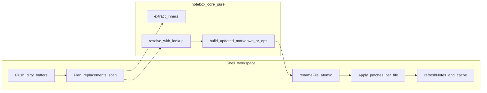

# Phase 5 design: rename-safe wiki link maintenance (WL-5)

**Status:** Design approved for implementation.

This document defines a safe, minimal, filesystem-first rename maintenance flow for inbox wiki links. It extends `WL-5` in [wiki-links-phased-roadmap.md](./wiki-links-phased-roadmap.md) and follows the architecture boundaries in [wiki-link-indexing-architecture.md](../architecture/wiki-link-indexing-architecture.md).

## Goals and boundaries

- Keep `[[...]]` links valid when an inbox note is renamed through the app rename flow.
- Preserve Markdown readability (no hidden IDs, no proprietary metadata).
- Keep side effects in shell/workspace; keep `@notebox/core` pure.
- Do not introduce a global persistent index, background worker, or native rewrite logic in this phase.

## 1) Rename event definition

### What counts as a rename

- A successful inbox markdown filename identity change through the existing rename path:
  - UI rename action
  - workspace `renameNote`
  - `renameInboxMarkdownNote` executes `fs.renameFile(oldUri, newUri)`
- A title edit without a filename change is not a rename event.
- Renames performed outside the app are out of scope for this phase.

### Event origin

- Workspace/shell owns the event and orchestration.
- Editor remains a text surface and does not perform vault traversal or file rewrites.

## 2) Scope of rewrite

### Syntax in scope

- Only `[[target]]` and `[[target|display]]`.
- Rewrite only the target segment.
- Preserve display text in `[[target|display]]`.

### Rewrite eligibility

- Rewrite only links that resolve unambiguously (`kind: "open"`) to the renamed note's pre-rename URI.
- Self-links are eligible and must be rewritten.
- Do not rewrite:
  - `create`
  - `unsupported`
  - `ambiguous`

### Vault scope

- Inbox markdown notes only (current resolver policy).
- Non-inbox/path semantics remain out of scope.

## 3) Matching strategy

- Single full inbox pass per rename; no durable index added.
- Reuse WL-4 read patterns:
  - build one lookup table from pre-rename note refs
  - extract wiki inners from each body
  - resolve each inner with lookup
- Apply rewrite rules per occurrence in one scan pass.

### Tradeoffs

- Correctness: deterministic, URI-based eligibility.
- Simplicity: no incremental index lifecycle.
- Performance: linear scan is acceptable for explicit rename actions; track touched files and touched bytes.

## 4) Rewrite algorithm split (core vs shell)

### `@notebox/core` responsibilities

- Provide pure rewrite planning helpers:
  - parse/extract wiki links
  - resolve with precomputed lookup
  - produce replacement operations or rewritten markdown string
- No file I/O or workspace state mutation.

### shell/workspace responsibilities

- Flush pending edits before rename workflow.
- Snapshot pre-rename note refs/content.
- Run plan pass and collect changed files + counts.
- Execute `renameFile`, then apply markdown writes for planned files.
- Refresh notes/state and surface user-visible outcome/errors.

## 5) Safety model

### Write ordering

1. Flush unsaved editor state.
2. Plan rewrites from pre-rename snapshot.
3. Rename file (`oldUri -> newUri`).
4. Apply planned markdown writes, including the renamed file under `newUri`.

### Failure policy

- If rename fails: apply no markdown rewrites.
- If apply fails mid-batch: partial success can occur in this phase.
- Require explicit surfaced summary of successes/failures; no silent repair.

### Dry-run / preview

- Plan mode must return at least:
  - files touched
  - links touched
  - ambiguous links skipped
- Confirm-before-apply UX is part of the phase (at minimum a count summary).

## 6) Performance model

- Planning complexity: one scan over inbox notes, O(1) resolve per extracted link.
- Apply complexity: proportional to changed files and touched bytes.
- Acceptable because operation is explicit and infrequent (rename action), not continuous.
- No background worker in this phase to avoid implicit/hidden rewriting behavior.

## 7) UX decisions

- Rename flow is explicit and user-triggered.
- When rewrites are planned, show impact summary (counts; optional short file list).
- Ambiguous links are never auto-rewritten; communicate skipped count clearly.
- Partial failures must be visible and actionable (retry for failed files only).

## 8) Explicit non-goals

- No incremental or durable global link index.
- No background processing for continuous link sync.
- No cross-folder/path-rich link semantics.
- No rewriting of non-wikilink syntax (``, plain text, HTML).
- No native rewrite engine in this phase.

## 9) Phased internal execution

### Phase 5A: core helpers

- Add pure rewrite planning helpers.
- Add golden tests for:
  - `[[target]]`
  - `[[target|display]]`
  - `Inbox/` prefix behavior
  - self-link rewrite
  - skip ambiguous/create/unsupported

### Phase 5B: plan-only workspace integration

- Add plan pass to rename flow.
- Report/log counts without applying cross-file writes yet.

### Phase 5C: full apply integration

- After successful rename, apply planned updates across affected inbox files.
- Update in-memory content maps and selection references coherently.

### Phase 5D: safety and UX polish

- Confirm/preview step before apply.
- Atomic write approach per file where available.
- Partial-failure summaries + retry path.

## What could go wrong

1. Stale snapshot if active editor text is not flushed before planning.
   - Mitigation: preserve flush-before-rename invariant.
2. Partial apply leaves mixed old/new link targets.
   - Mitigation: explicit failure roster and targeted retry path.
3. Ambiguous links remain stale and users expect auto-fix.
   - Mitigation: never auto-rewrite ambiguous; show skipped summaries.
4. Extract/resolve/rewrite behavior drifts across modules.
   - Mitigation: one shared core extraction and rewrite policy path.
5. Destination filename collision detected late.
   - Mitigation: keep single rename entrypoint with existing collision checks.
